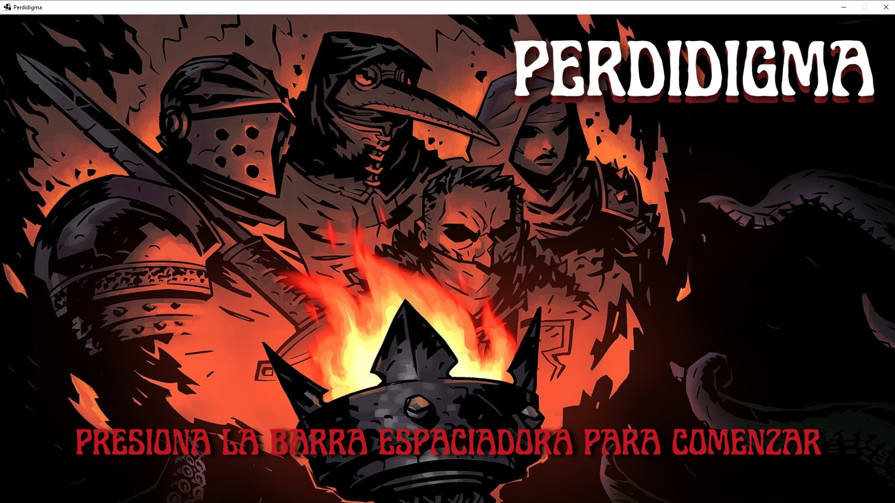
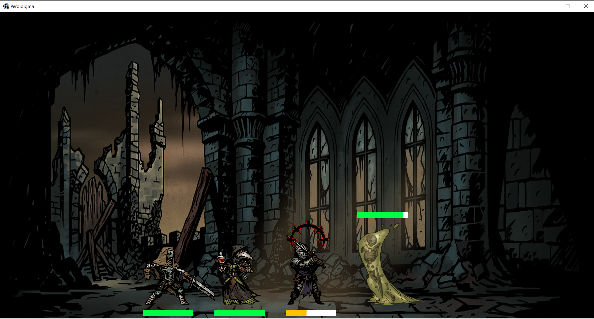
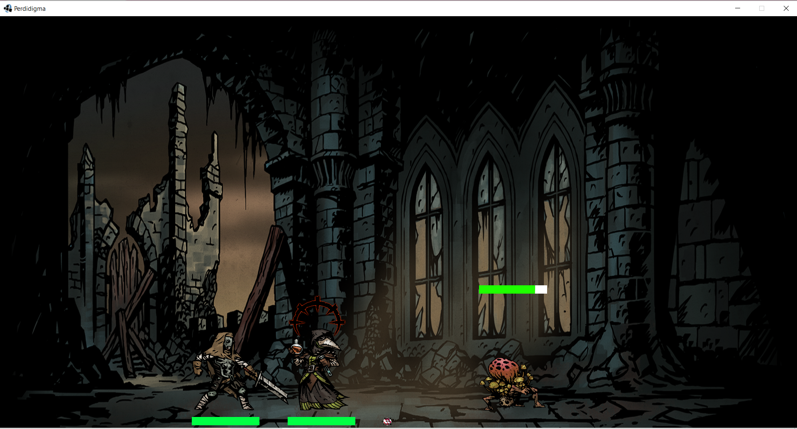
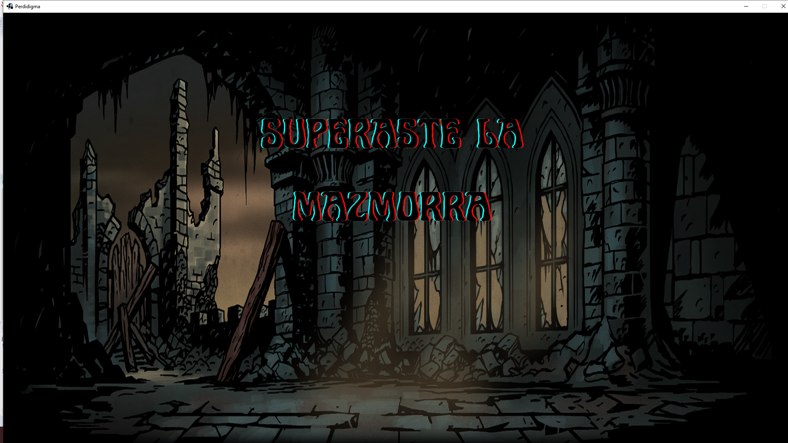
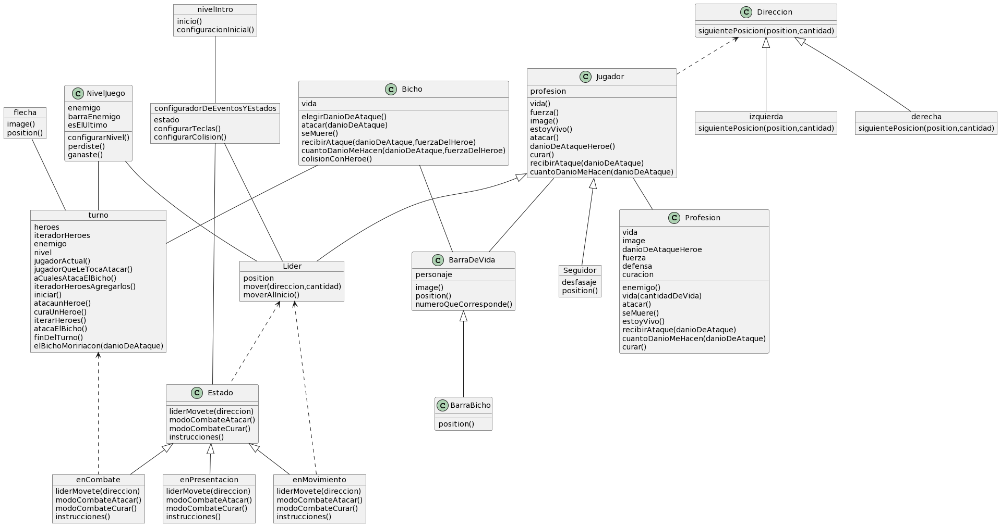

# Perdidigma

## Equipo de desarrollo

- Dante Ball
- Luna Houli
- Alessandro Caragiulo
- Matias Pereda
- Kiara Ferrari

## Capturas

## Reglas de Juego / Instrucciones

El objetivo del juego es que los tres poderosos héroes, el Doctor, el Caballero y el Leproso avancen hacia los enemigos que se presentan en el camino para combatir con ellos y obviamente, salir victoriosos. Los posibles enemigos a encontrar son el terrorífico y baboso Ectoplasma y el contaminoso Hongo. Al colisionar con los malditos enemigos, los héroes entran en combate y pueden atactar y darse curación, para así mantenerse con vida. 

- Para comenzar el juego: barra espaciadora
- Para avanzar: flechas derecha e izquierda
- Para salir: tecla E
- Para pegar: tecla G
- Para curar: tecla H

## Documento teórico

#### Polimorfismo

Tenemos un conjunto de héroes que conocen sus posiciones, referenciadas a un líder, integrante de este grupo constituido por los objetos líder, seguidor 1 y seguidor 2. Lo que nuestros héroes desconocen es cuánto daño infligen sus ataques y su curación. Esto solo es conocido por las profesiones (caballero, brujo y médico) y gracias a la composición, nuestros héroes van a poder atacar, recibir daño y demás. 
El polimorfismo se presenta, fácilmente distinguible, entre las profesiones que van a tener que entender los mismos mensajes para ser intercambiables, para los ya varias veces mencionados, héroes. 

#### Colecciones

Al momento de realizar los turnos de ataque para poder defendernos del gran y feo bicho, usamos colecciones con sus métodos addAll y head para poder marcar a quien le corresponde interpretar el mensaje de ataque, una vez que la colección queda vacía llega el momento de nuestro antagonista de atacar. Luego de este evento haber finalizado se vuelve agregar a nuestros héroes a la colección que los turna y esto se repite hasta que o perdamos a nuestros tres afamados héroes o el bicho pase a mejor vida. En este caso no necesitamos tirar del efecto, solo utilizamos filter y los métodos ya mencionados.

#### Clases

Entre las diferentes profesiones hay muchos mensajes que todas entienden y que tienen efectos muy similares. Algunas profesiones podrán imprimirle más fuerza a sus ataques que otras, lo mismo con su defensa y curación, pero esto se soluciona con algún coeficiente o atributo de fuerza en la propia clase. El tema es que el resto del código es muy similar y si se tuvieran que definir estos métodos profesión por profesión, seguramente encontraríamos mucho código repetido y como no queremos matar gatitos, usamos clases para generalizar y abstraer los comportamientos de las profesiones. Luego se instancia y se les asignan sus atributos dependiendo de si es caballero, brujo o doctor.  

#### Herencia

Entre los seguidores y el líder hay comportamiento compartido (vida, curar, recibirAtaque, etc.) para esto se decidió desarrollar una superclase que luego herede este comportamiento al objeto líder y a la clase seguidor. No se instancia directamente esta superclase (jugador) ya que también presentan mensajes cuyo código es disímil por ejemplo el único que se mueve de manera independiente es el líder, los seguidores le tienen que preguntar constantemente dónde está para poder acompañarlo en su aventura. 

#### Delegación de responsabilidades
Se ve muy claro el concepto de delegación de responsabilidades cuando tanto el bicho ataca al héroe que está primero en la fila de ataque, como cuando el bicho es atacado por los héroes. En ambos casos el atacado sabe cuanto daño le va a provocar su atacante en base a la fuerza de este y el nivel de defensa del atacado (en caso de que corresponda). Esto se podría modificar con un setter de vida de la víctima, también se necesitaria saber su nivel de defensa pero lo mejor es que cada uno sepa cuánto daño le va a causar un ataque infligido a su persona.

## Diagrama de clases

## Otros

- Curso: Jueves a la mañana. UTN FRBA
- Grupo: Paradigmas de Programación
- Profesor: Alfredo Sanzo
- Versión de Wollok: 2021
- Una vez terminado, no tenemos problemas en que el repositorio sea público.
