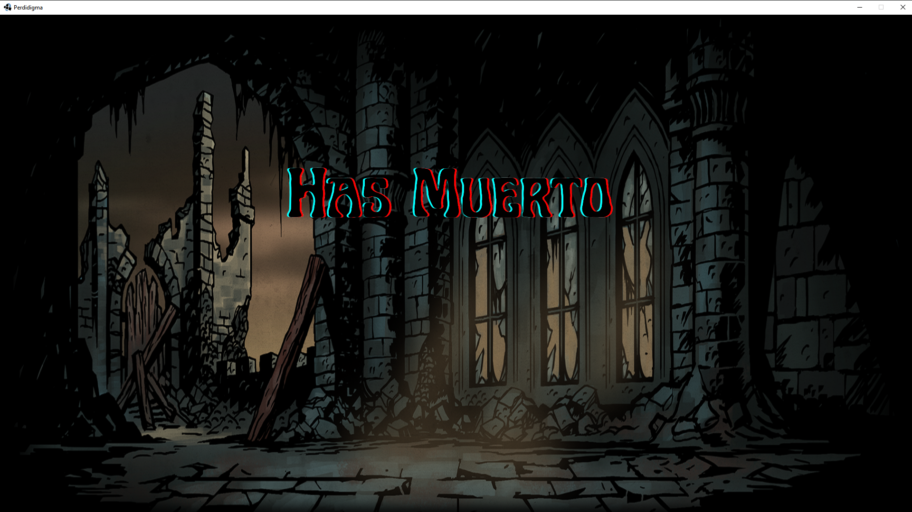

# Perdidigma

## Equipo de desarrollo

- Dante Ball
- Luna Houli
- Alessandro Caragiulo
- Matias Pereda
- Kiara Ferrari

## Capturas

## Reglas de Juego / Instrucciones

El objetivo del juego es que los tres poderosos héroes, el Doctor, el Caballero y el Leproso avancen hacia los enemigos que se presentan en el camino para combatir con ellos y obviamente, salir victoriosos. Los posibles enemigos a encontrar son el terrorífico y baboso Ectoplasma y el contaminoso Hongo. Al colisionar con los malditos enemigos, los héroes entran en combate y pueden atactar y darse curación, para así mantenerse con vida. 

- Para comenzar el juego: barra espaciadora
- Para salir: tecla E
- Para avanzar: flechas derecha e izquierda
- Para pegar: tecla G
- Para curar: tecla H

## Documento teórico y diagrama de clases

https://docs.google.com/document/d/1_CM8MyWX022y0E7vD8eAn83HxJyYBf7TI2wbHQs3AlE/edit?usp=sharing

## Otros

- Paradigmas de Programación. Curso: Jueves a la mañana. UTN FRBA
- Profesor: Alfredo Sanzo
- Versión de wollok: 2021
- Una vez terminado, no tenemos problemas en que el repositorio sea público / queremos manternerlo privado
